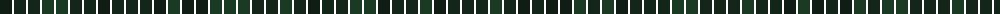
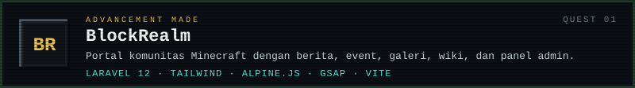
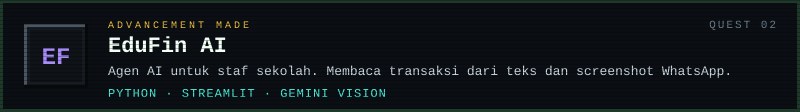
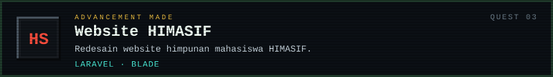
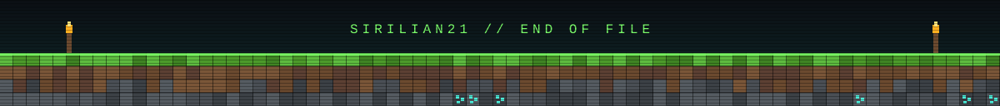

<!--
  Profil GitHub v2. Tema Minecraft futuristik.
  File yang dipakai (semua di root repo ini): banner.svg, divider.svg, hotbar.svg,
  quest-blockrealm.svg, quest-edufin.svg, quest-himasif.svg, mob.svg, footer.svg
  Perbarui baris "SEKARANG" tiap bulan. Hapus baris itu jika sudah tidak berlaku.
-->

 

<a href="#hotbar"><code>HOTBAR</code></a> &nbsp;
<a href="#quest-log"><code>QUEST LOG</code></a> &nbsp;
<a href="#contact"><code>CONTACT</code></a>

  

Mahasiswa di Indonesia. Saya membangun aplikasi web dengan Laravel dan menambahkan fitur AI dengan Python.

`SEKARANG` Redesain website HIMASIF dengan Laravel.

## HOTBAR

## QUEST LOG

<!--
  Kartu statistik: aktifkan setelah akunmu punya cukup repo publik dan commit.
  Dengan data sedikit, kartu menampilkan peringkat rendah dan bahasa kosong.

  
-->

## CONTACT

Email: [sirilian21@gmail.com](mailto:sirilian21@gmail.com) &nbsp;·&nbsp; GitHub: [@Sirilian21](https://github.com/Sirilian21)

